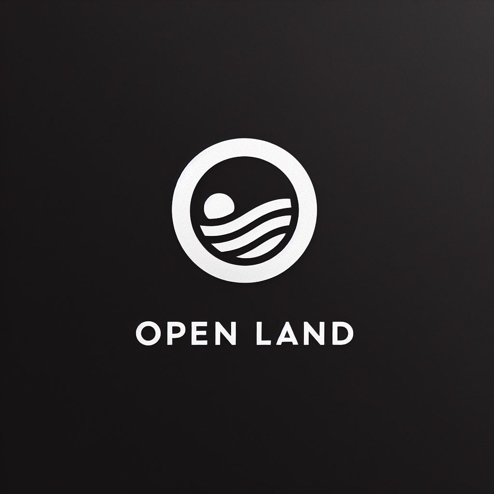

# Desing System

This is the source code for https://desing-system.dev by Open Land

 

## Features

- Built with [Shadcn UI](https://https://ui.shadcn.com//) and [Tailwind CSS](https://tailwindcss.com/)
- Customizable
- Dark mode support
- [Figma Kit](https://www.figma.com/community/file/1354464067434498042)

## Getting Started

This design system is totally easy to use with the aim of facilitating upcoming new projects. The design system is a challenge for our team. You can gladly contribute and guide us with ideas to improve... We would be keen to hear any feedback on this project.

 
 
 
 

## Components

_General_

- [x] Button
- [ ] Typography
- [ ] Icon
- [ ] Image
- [x] Carousel

_Data Input_

- [ ] Input
- [ ] InputNumber
- [ ] Select
- [ ] Checkbox
- [ ] Radio
- [ ] Toggle
- [ ] Upload
- [ ] Slider
- [ ] Date picker
- [ ] Time picker
- [ ] Form

_Layout_

- [ ] Divider

_Display_

- [ ] Card
- [ ] Avatar
- [ ] Accordion
- [x] Alert
- [x] Badge
- [ ] Menu
- [ ] Tooltips
- [ ] Tables
- [ ] Code block

_Navigation_

- [ ] Tabs
- [ ] Breadcrumb
- [ ] Dropdown
- [ ] Menu
- [ ] Page Header
- [ ] Sidebar
- [ ] Flyout menu
- [ ] Steps

_Overlay_

- [ ] Modal
- [ ] Context Menu
- [ ] Drawer / SidePanel
- [ ] Toast messages / Notification
- [ ] Progress
- [ ] Feeds / Timeline

## Documentation

If you want to know more about this design system visit

- https://design-system/docs/

## License

Design System is licensed under either of

- MIT license (LICENSE-MIT or https://opensource.org/licenses/MIT)
